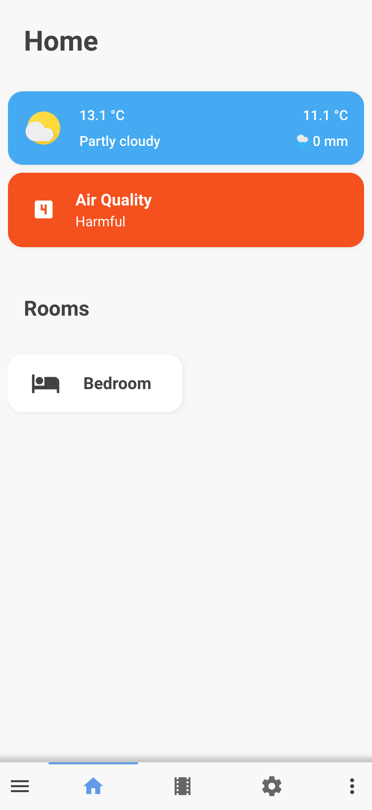
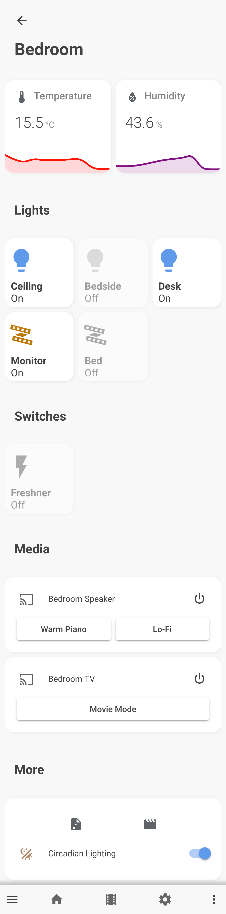
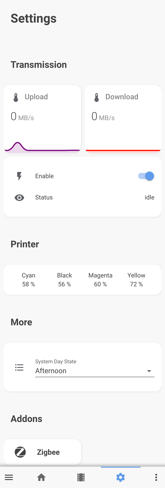

  
  <h1 align=center>Home Automation</h1>
  
My home automation setup inside an universitary apartement room.

<h1></h1>

  
  
  
  
  

## Screenshots 
|||||
|---|---|---|---|

### HaDashboard  

