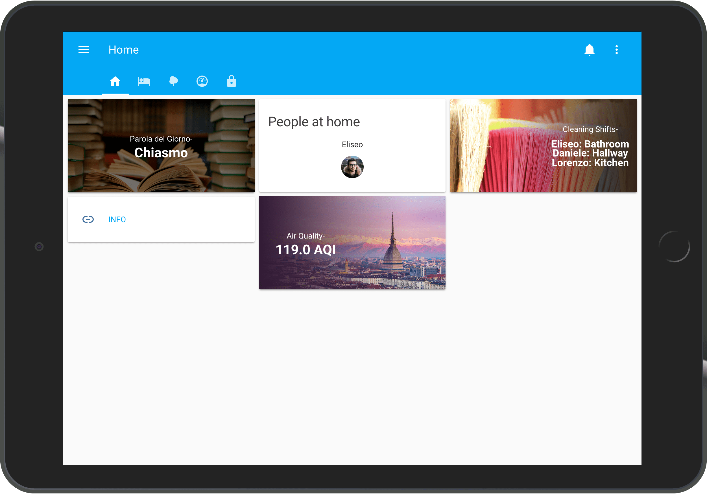
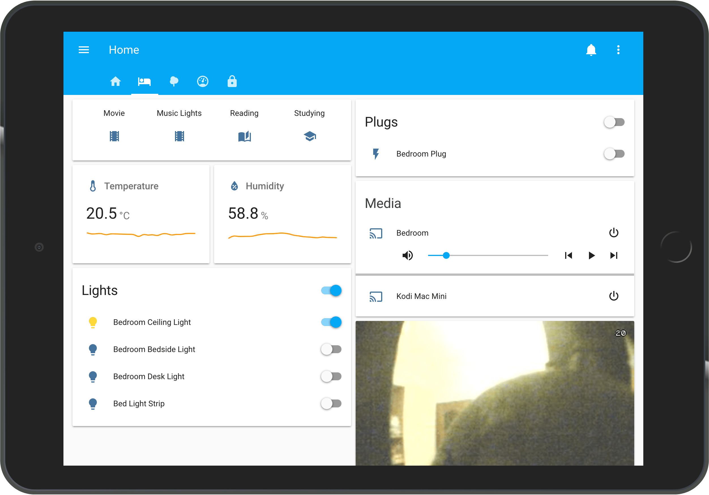
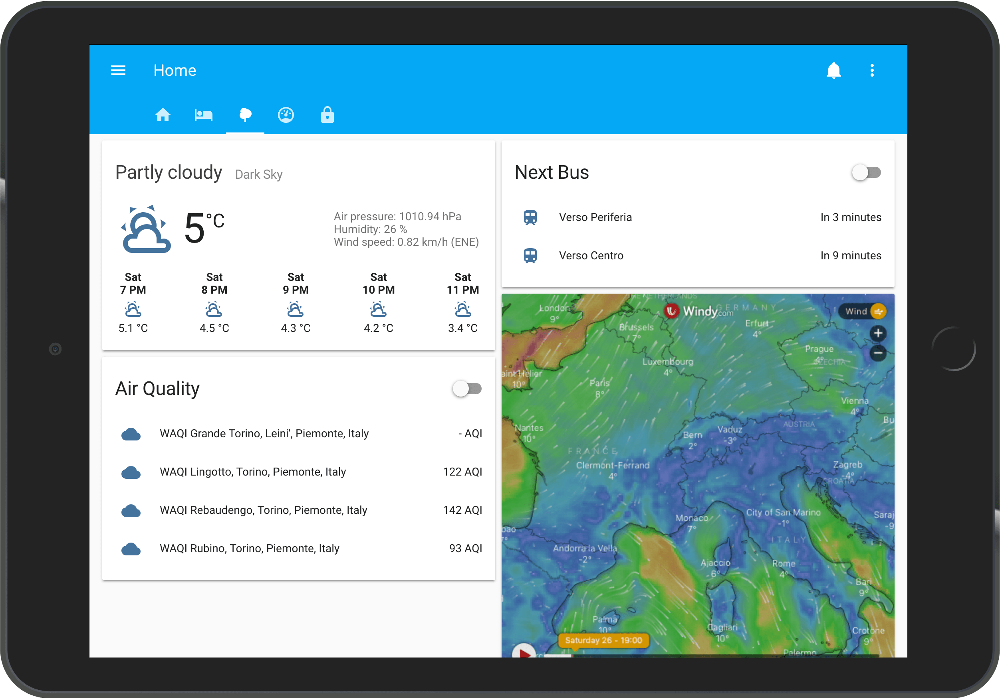
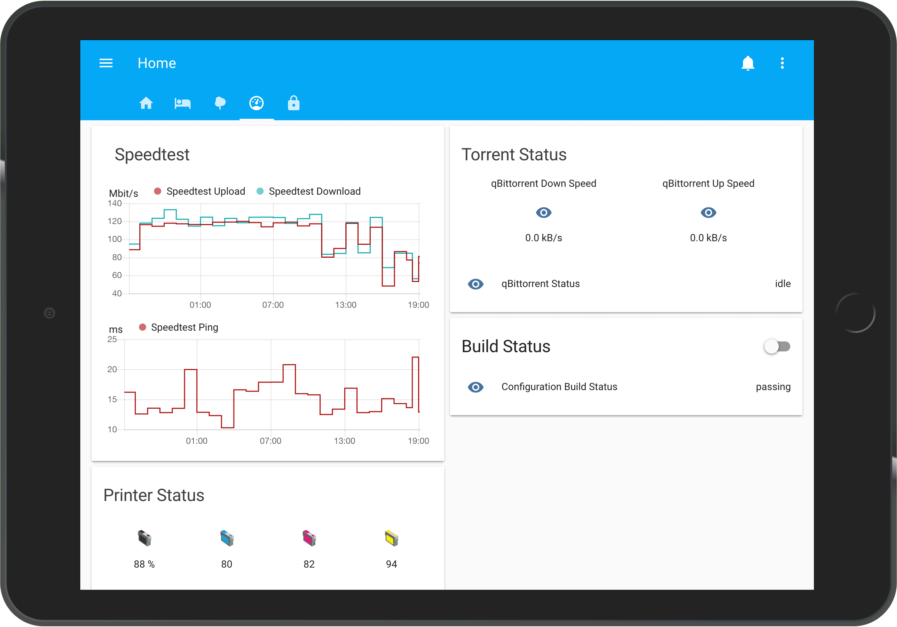
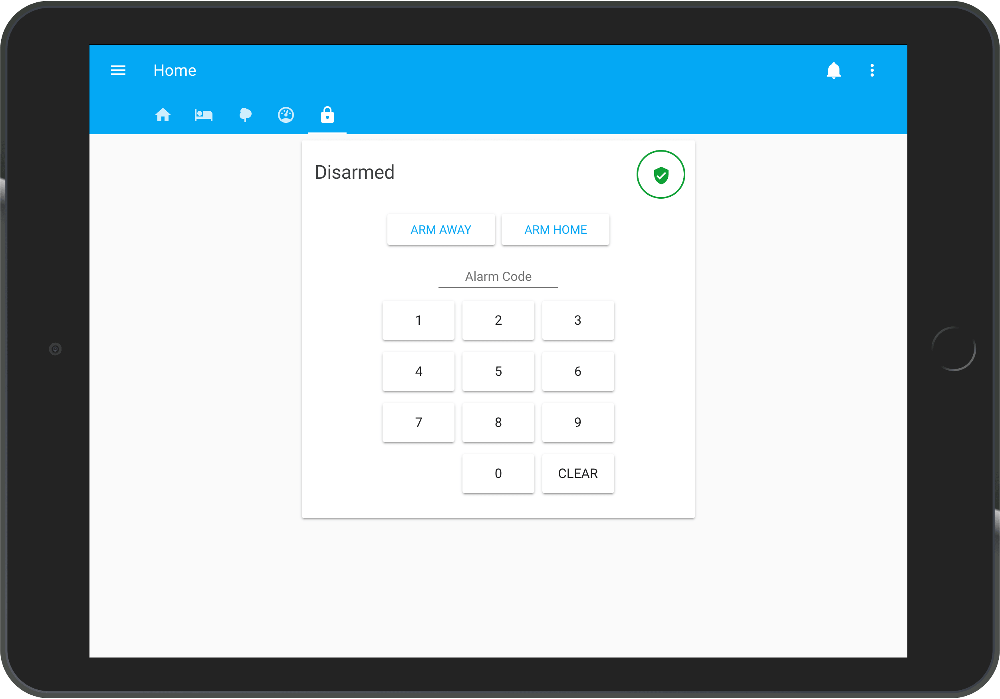
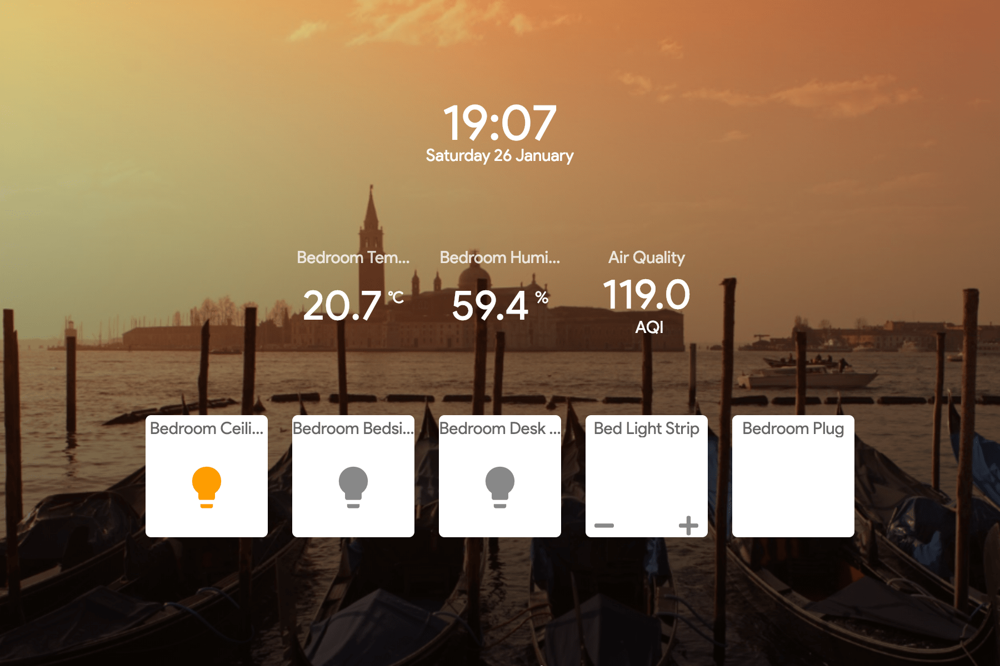

  
  <h1 align=center>Home Automation</h1>
  
A simple starting point to Home Automation inside a universitary apartement room.

<h1></h1>

  

## What's in my room?
- 4 Generic Warm Lights
- 1 RGB Light Strip
- 1 DHT22 Sensor
- 1 Tablet used as a controller
- 1 Epson XP-205 printer
- 1 PS3 Eye Camera
- 1 Amazon Dash Button
- 1 Google Home Mini
- 1 Mac Mini
- 1 Rapberry Pi Zero W

## DIY Stuff
- RGB Light Controller (ESP8266 based)
- RF Bridge (Raspberry Pi)
- Security Camera (Raspberry Pi) 

## Control Points
- Tablet on the wall
- Amazon dash button
- Voice input 
- Web Interface

## What I Run?
- 2 instances of Home Assistant (3 including the development one)
- 1 instance of AppDaemon
- 1 instance of MotionEye
- 1 instance of AmazonDash

## In the ☁
- 1 instance of "Cute Cat" CloudMQTT (Owntracks)

## Screenshots 

### HaDashboard  

